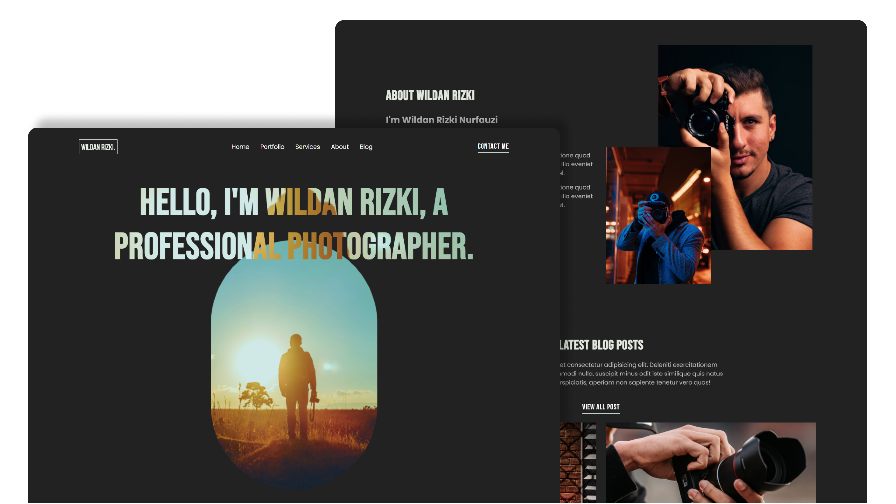

# About Me

- BEING ABLE TO GET ALONG WELL WITH OTHERS
> “I like the idea of teamwork and know that this will be an important part of this role. I am friendly, approachable, and always keen to help others when they are in need. In the past, I have been told that my people skills make it easy for me to get along with pretty much anyone.”

- BEING ABLE TO PRIORITIZE AND DELEGATE TASKS
> “I believe patience is an important quality when it comes to working with others or when taking on any kind of project or task. Patience helps give me the ability to prioritize what needs to be done first and how best to go about doing it. During periods where I’ve felt overwhelmed, this has been one of my strengths – being able to identify what is most important.”

#### [Follow my Instagram](https://www.instagram.com/wildanrizkii/)

